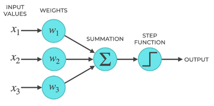
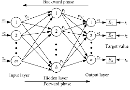

In this project, I will be implementing the Perceptron and BP Neural Network based on only numpy.

## Perceptron
A perceptron is a machine learning algorithm that classifies inputs into two categories. Perceptrons are one of the simplest types of artificial neuron, so we can think of them as the foundation of neural networks.

The following is the structure of a Perceptron:

## BP Neural Network
A backpropagation (BP) neural network is a type of artificial neural network that uses a multi-layer structure to learn and improve its performance.
The neural network algorithm is a multi-layer feedforward network trained according to error back propagation algorithm. It is one of the most widely applied neural network models.

The following is the structure of a BP Neural Network:

